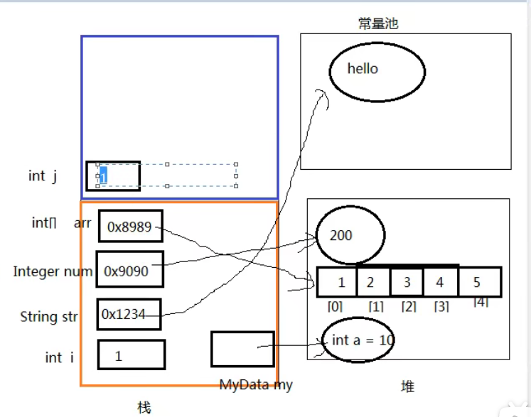
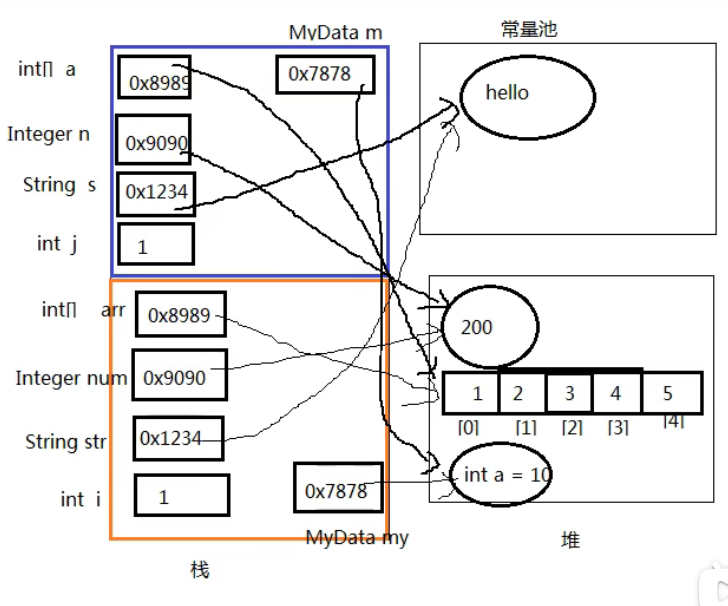

# 第一季

## 自增变量

赋值=，最后计算
=右边的从左到右加载至一次压入操作数栈
实际先算那个，看远算符优先级
自增、自减操作都是字节修改变量的值，不经过操作数栈
最后额赋值之前，临时结果也存储在操作数栈中

```java
public static void main(String[] args) {
    //i=1
    int i = 1;
    //i=1
    i = i++;
    // j =1 i = 2
    int j = i++;
    // k=11 j=1 i=4
    int k = i + ++i * i++;
    System.out.println("i=" + i);
    System.out.println("j=" + j);
    System.out.println("k=" + k);
}
```

## Singleton

```java
/**
 * 只有一个实例
 * 必须自行创建这个实例
 * 向整个系统提供这个实例
 * <p>
 * 饿汉式：直接创建对象，不存在线程安全问题
 * 1.直接实例化饿汉式
 * 2.枚举式
 * 3.静态代码块（适合复杂实例化）
 * 懒汉式：延迟创建对象
 * 4.线程不安全（使用单线程）
 * 5.线程安全
 * 6.静态内部类（使用多线程）
 */
class Singleton1 {
    public static final Singleton1 INSTANCE = new Singleton1();

    private Singleton1() {

    }
}

enum Singleton2 {
    INSTANCE
}

class Singleton3 {
    public static final Singleton3 INSTANCE;

    //当string需要动态获取
    private String s;

    static {
        String s1 = "xxx";
        INSTANCE = new Singleton3(s1);
    }

    private Singleton3(String s) {
        this.s = s;
    }
}

class Singleton4 {
    private static Singleton4 INSTANCE;

    private Singleton4() {

    }

    public static Singleton4 getInstance() {
        //部分逻辑  线程不安全
        try {
            Thread.sleep(100);
        } catch (Exception e) {
            e.printStackTrace();
        }
        INSTANCE = new Singleton4();

        return INSTANCE;
    }
}

class Singleton5 {
    private static Singleton5 INSTANCE;

    private Singleton5() {

    }

    public static Singleton5 getInstance() {
        //线程安全
        if (INSTANCE == null) {
            synchronized (Singleton5.class) {
                try {
                    Thread.sleep(100);
                } catch (Exception e) {
                    e.printStackTrace();
                }
                INSTANCE = new Singleton5();
            }
        }
        return INSTANCE;
    }
}

class Singleton6 {

    private Singleton6() {

    }

    //静态被不累不会自动随着外部类的加载和初始化而初始化，他是单独去加载和初始化的
    //因为实在内部类加载和初始化，所以是线程安全的
    private static class Inner {
        private static final Singleton6 INSTANCE = new Singleton6();
    }

    public static Singleton6 getInstance() {
        return Inner.INSTANCE;
    }
}
```

## 类初始化和实例初始化

```java
/**
 * 父类的初始化<clinit>
 * 1.j=method()
 * 2.父类的静态代码块
 * <p>
 * 父类实例化方法：
 * 1.super()（最前）
 * 2.i=test()
 * 3.父类的非静态代码块
 * 4.父类的无参构造（最后）
 * <p>
 * 非静态方法前面有一个默认地向this
 * this在构造器或<init>()它表示的是正在创建的对象，因为这里创建的Son对象，所以
 * test()执行的是子类重写的代码
 * <p>
 * 这里i=test()执行的是子类重写的test()方法
 */
public class Father {
    private int i = test();
    public static int j = method();

    static {
        System.out.println("(1)");
    }

    Father() {
        System.out.println("(2)");
    }

    {
        System.out.println("(3)");
    }

    public int test() {
        System.out.println("(4)");
        return 1;
    }

    public static int method() {
        System.out.println("(5)");
        return 1;
    }

}
```

```java
/**
 * 子类的初始化<clinit>
 * 1.j=method()
 * 2.子类的静态代码块
 * <p>
 * 先初始化父类  （5）（1）
 * 初始化子类 （10） （6）
 * <p>
 * 子类实例化方法：
 * 1.super()（最前）  （9） （3） （2）
 * 2.i=test()          （9）
 * 3.子类的非静态代码块    （8）
 * 4.子类的无参构造（最后）   （7）
 * <p>
 * 因为创建了两个Son对象，因此实例化方法<init>()执行两次
 * <p>
 * （9） （3） （2） （9） （8） （7）
 * <p>
 * <p>
 * <p>
 * 哪些方法不能被重写：
 * final方法
 * 静态方法
 * private等子类中不可见方法
 * 对象的多态：
 * 子类如果重写了父类的方法，通过子类对象调用的一定是子类重写过的代码
 * 非静态方法默认的调用对象是this
 * this对象在构选器或者说<init>方法中就是正在创建的对象
 */
public class Son extends Father {
    private int i = test();
    public static int j = method();

    static {
        System.out.println("(6)");
    }

    Son() {
        //super();   写或不写，在子类构造器中一定会调用父类的构造器
        System.out.println("(7)");
    }

    {
        System.out.println("(8)");
    }

    @Override
    public int test() {
        System.out.println("(9)");
        return 1;
    }

    public static int method() {
        System.out.println("(10)");
        return 1;
    }

    public static void main(String[] args) {
        /**
         * 类初始化过程：
         * 1.一个类的创建实例需要先加载初始化该类
         *      main方法所在的类需要先加载和初始化
         *      仅发生类初始化 ，不发生实例初始化 （5）（1）（10）（6）
         * 2.一个子类要初始化需要先初始化父类
         * 3.一个类初始化就是执行<clinit>()方法
         *      <clinit>方法由静态类变量显示赋值代码和静态代码块组成
         *      类变量显式赋值代码和静态代码块代码从上到下顺序执行
         *      <clinit>方法只执行一次
         *
         * 实例初始化过程：
         * 1.实力初始化就是执行<init>()方法
         *      <init>()方法可能重在有多个，有几个构造器就有几个<init>()方法
         *      <init>()方法由非静态实例变量显示赋值代码和非静态代码块、对应构造器代码组成
         *      非静态实例变量显示赋值代码和非静态代码块代码从上到下顺序执行，而对应构造器的代码最后执行
         *      每次创建实例对象，调用对应构造器，执行的就是对应的<init>方法
         *      <init>方法的首行是super()或super(实参列表)，即对应父类的<init>方法
         */
        Son son1 = new Son();
        System.out.println();
        Son son2 = new Son();
    }
}

```

**方法重载的规则？**

方法名一致，参数列表中参数的顺序，类型，个数不同。

重载与方法的返回值无关，存在于父类和子类，同类中。

可以抛出不同的异常，可以有不同修饰符。

**方法重写的规则？**

参数列表、方法名、返回值类型必须完全一致，构造方法不能被重写；

声明为 final 的方法 不能被重写；

声明为 static 的方法不存在重写(重写和多态联合才有意义);

访问权限不能比 父类更低;重写之后的方法不能抛出更宽泛的异常

**重载和重写的区别？**

方法的重写 Overriding 和重载 Overloading 是 Java 多态性的不同表现。

重写 Overriding 是父类与子类之间多态性的一种表现，

重载 Overloading 是一个类中多态性的一种表现。

如 果在子类中定义某方法与其父类有相同的名称和参数，我们说该方法被重写 (Overriding)。 子类的对象使用这个方法时，将调用子类中的定义，对它而言，父类中的定义如同被“屏蔽” 了。

如果在一个类中定义了多个同名的方法，它们或有不同的参数个数或有不同的参数类型， 则称为方法的重载(Overloading)。

## 方法参数传递

```java
public class Exam {

    public static void main(String[] args) {
        int i = 1;
        String str = "hello";
        Integer num = 200;
        int[] arr = {1, 2, 3, 4, 5};
        MyData my = new MyData();
        change(i, str, num, arr, my);
        System.out.println("i=" + i);
        System.out.println("str=" + str);
        System.out.println("num=" + num);
        System.out.println("arr=" + Arrays.toString(arr));
        System.out.println("my.a=" + my.a);
    }

    /**
     * 实参给形参赋值
     *
     * @param j 基本数据类型  数据值
     * @param s 引用数据类型  地址值     String、包装类等对象不可变性
     * @param n
     * @param a
     * @param m
     */
    public static void change(int j, String s, Integer n, int[] a, MyData m) {
        j += 1;
        s += "world";
        n += 1;
        a[0] += 1;
        m.a += 1;
        System.out.println(j);
        System.out.println(s);
        System.out.println(n);
        System.out.println(Arrays.toString(a));
        System.out.println( m.a);
    }
}

class MyData {
    int a = 10;
}
```





## 递归与迭代

n个台阶，一次只能走一阶或两阶，问有多少种走法？

```java
public static void main(String[] args) {
    System.out.println(go(4));
}

public static int go(int n) {
    if (n == 1 || n == 2) {
        return n;
    }
    return go(n - 2) + go(n - 1);
}
```

## 成员变量与局部变量

```java
public class Exam6 {
    /**
     * 局部变量：每个线程，每次调用执行的都是新的声明周期
     * 实例变量：随着对象的创建而初始化，随着对象的回收而消亡，每一个实例变量都是独立的
     * 类变量：随着类的初始化而初始化，随着类的卸载而消亡，该类的所有对象的类变量是共享的
     */
    /**
     * 局部变量：栈
     * 实例变量：堆
     * 类变量：方法去
     */
    static int s;
    int i;
    int j;

    {
        int i = 1;
        //就近原则
        i++;
        j++;
        s++;
    }

    public void test(int j) {
        j++;
        //作用域
        i++;
        s++;
    }

    public static void main(String[] args) {
        Exam6 obj1 = new Exam6();
        Exam6 obj2 = new Exam6();
        obj1.test(10);
        obj1.test(20);
        obj2.test(30);
        /*
        i=2,j=1,s=5
        i=1,j=1,s=5
         */
        System.out.println("i=" + obj1.i + ",j=" + obj1.j + ",s=" + s);
        System.out.println("i=" + obj2.i + ",j=" + obj2.j + ",s=" + s);
    }
}
```

## 事务的传播行为

+ 事务的属性

  propagation：用来设置事务的传播行为

  事务的传播行为：一个方法运行在了一个开启了事务的方法中时，当前方法是使用原来的事务还是开启一个新的事务

  - Propagation.REQUIRED：默认值，使用原来的事务
  - Propagation.REQUIRES_NEW：将原来的事务挂起，开启一个新的事务

+ isolation：用来设置事物的隔离级别

  + Isolation.REPEATABLE_READ：可重复读，MySQL默认的隔离级别

  + Isolation.READ_COMMITTED：读已提交，Oracle默认的隔离级别，并发誓通常使用的隔离级别 


 